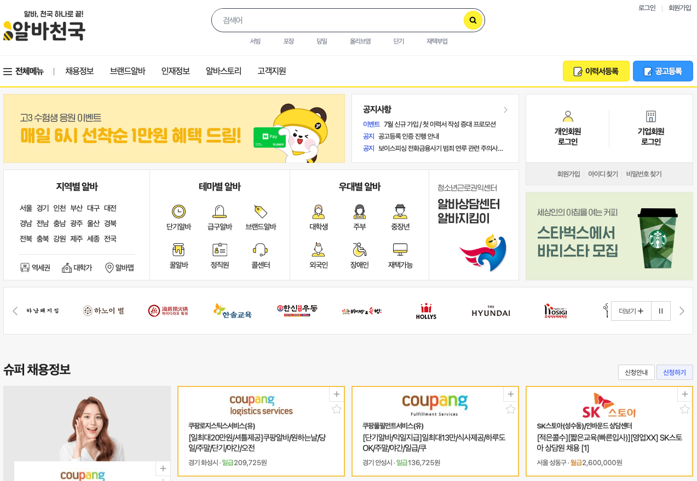

# 알바천국 클론코딩 

### 1. 프로젝트 개요

- 팀원 : (BE) 강영준, 김나영, 유시환, 이지원, 진민지
- 개간 : 2022년 07월 21일(금) ~ 07월 27일(목)  

### 2. 프로젝트 소개

페이지별 주요기능

|라우트|담당지|내용|
|:--|:--|:--|
|Home|김나영|메인페이지|
|Job, JobDetail|이지원|채용정보에 대한 소개페이지|
|Resume, ResumeDetail|진민지|인재정보에 대한 소개페이지|
|Story, StoryDetail|김나영, 유시환|알바후기에 대한 커뮤니티페이지|
|Login, Signup|강영준|로그인페이지|

### 3. 기술스택

     

### 4. 트러블 슈팅

### 1-1)  this.createdAt = story.getCreatedAt();에서 getCreatedAt() 오류 발생

- Application에서 @EnableJpaAuditing를 추가하지 않아 발생 + 오타(createAt) → 추가 및 수정 후 정상적으로 작동

### 1-2) 데이터베이스에는 변경사항이 정상적으로 작동되는데 응답은 400상태코드와 응답값 전달되지 않은 현상

- 좋아요 요청 후 클라이언트에게 내려주는 데이터가 정상적으로 나오지 않은 문제
- JSON으로 파싱되는데 있어서 Dto의 NoArgsConstructor가 접근레벨이 Protected로 설정되어 있었기에 다른 패키지에서 기본생성자 사용이 불가능
- 이로 인해 JSON으로 데이터가 정상적으로 나오지 않게됨 → 접근제어레벨 수정

### 1-3) PageImpl

- 한 페이지에 요청하는 size만큼의 데이터만 내려주는 게 아닌 전체 데이터 개수, 전체 페이지 개수, 첫 페이지 여부와 같이 페이지에 대한 정보를 프론트에게 같이 넘겨주는 게 더 합리적이라고 생각
- PageImpl을 사용했으나, totalPages에 대한 정보가 계속 1로 나오는 문제 발생
- 기존에는 PageImpl의 파라미터에는 실제 데이터, pageable, page.getTotalPages를 입력하였으나 전체 페이지개수가 아닌 page.getTotalElements를 넘겨야 전체 페이지 개수를 확인 가능

### 1-4) 속도 이슈

- 코드 자체의 문제는 없어보였지만 프론트엔드로 내려가는 데이터의 속도가 느리다는 피드백을 받게됨
- system.currenttimemillis()를 컨트롤러 계층, 서비스 계층에 로그를 남김으로써 해당 데이터 처리 속도를 확인
- 코드의 데이터 처리에는 큰 문제가 없다는 것을 확인하고 AWS 인프라 설정을 확인하였고 region 설정이 잘못되어 있었음을 확인
- 이를 수정 후 정상적인 응답속도가 되었음을 확인

### 1-5) 소셜로그인

- Oauth2.0 적용실패 - 강의에서 배운 것을 기반으로 먼저 소셜로그인을 구현 한 뒤, 정상 작동을 확인하고 Oauth2.0으로 구현하려고 계획
- 소셜로그인 redirect_url 부분을 제대로 이해하고 적용하지 못해서 정상작동하지 않았고 통신관련 다른 트러블에 우선순위가 밀려서 Oauth를 적용하지 못함
- 통신관련 다른 트러블 : 403에러가 CORS나 토큰쪽으로만 인식되는데 데이터를 보내고 받는 쪽의 DTO가 일치하지 않는 경우에도 403 오류가 발생함

### 2) 고민

### 2-1) 반복 접근하고, 변경이 잘 되지 않는 데이터를 캐싱에 사용할 수 있는 점

- 리프레시 토큰이 적절한 대상이 될 수 있다고 생각하고 이를 레디스를 활용하는 법을 고민
- 그러나 레디스를 적용하고 실제 사용에 있어 꽤 어려움을 겪었음. 정확히 레디스를 어떤 식으로 설정하고 사용해야하는지에 대한 이해가 부족했던 것이 아쉬움

### 2-2) 특정 게시물의 전체 및 상세 조회에서 해당 엔티티의 연관관계를 맺은 user의 모든 정보를 select절에서 가져오는 문제

- 필요한 건 해당 user의 username인데 user 테이블에 존재하는 성별,이메일, 카카오ID 와 같은 칼럼들도 한 번에 조회하는 문제점
- 프로젝션을 사용해서 원하는 컬럼만 가져올 수 있다고 생각하였으나 새로운 Dto를 생성해야한다는 문제
- 이러한 문제는 해당 Dto의 내부 클래스를 이용하여 해결하면 좋았을 것 같다고 생각

### 2-3) 쿼리Dsl

- 검색 데이터를 가져오는 과정에서 연관관계를 맺은 Comment의 데이터는 검색 후 상세페이지에 들어가서 조회할 수 있는 것이 합리적이라는 생각
- 지연로딩을 활용하기 위해 해당 엔티티의 ResponseDto에서 생성자 오버로딩을 이용
- @QueryProjection을 이용하여 Dto도 Q클래스를 생성하여 사용.
- 프록시상태 Comment에 엔티티 조회를 요청하지 않음. 이를 통해 불필요한 쿼리들을 줄일 수 있었음

### 2-4) 홈 화면 구성에서 새로운 Service 계층을 만들고 해당 HomeService가 StoryRepository와 JobRepository에 의존

- 그 차이는 미미하겠지만 HomeService에서 직접적으로 해당 Repository 또는 해당 엔티티의 Service 계층에 접근하는 방법은 어땠을까 고민
- 코드의 변경이 발생하였을 때, HomeService의 변경도 일어날 수 있다는 점
- 의존성을 최대한 줄이는 면에서 HomeController에서 직접 Repository를 가져오는 게 어땠을까라는 고민이 생김

### 2-5) page에 대한 정보를 받을 때 고민

- RequestParam 형식으로 page에 대한 정보를 받아야할지, @PathVariable로 page를 받아야할지 고민
- 첫 API 설계시에는 쿼리파라미터로 약속했으나 해당 문제에 대해서 뭐가 더 RESTful한지에 대한 명확한 기준을 알 수 없었음
